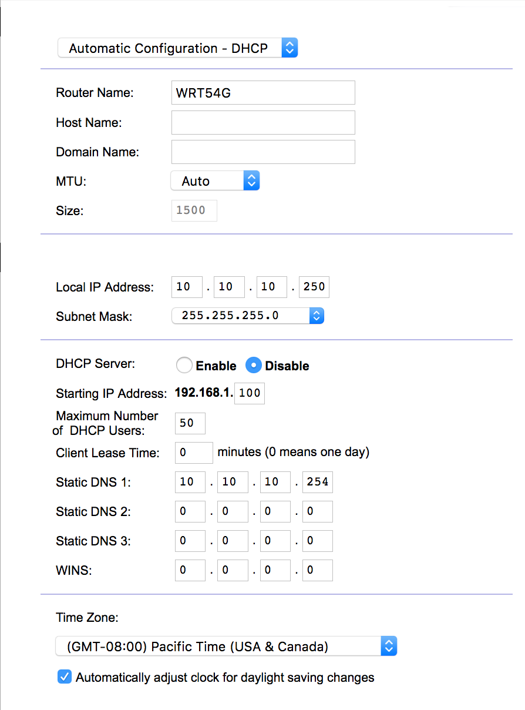
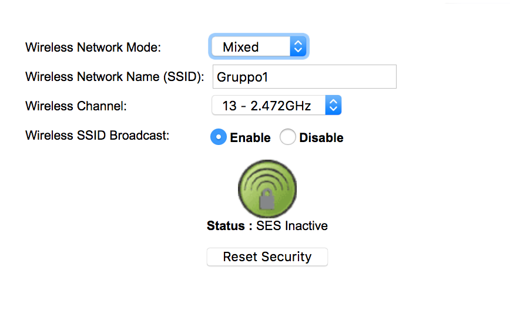
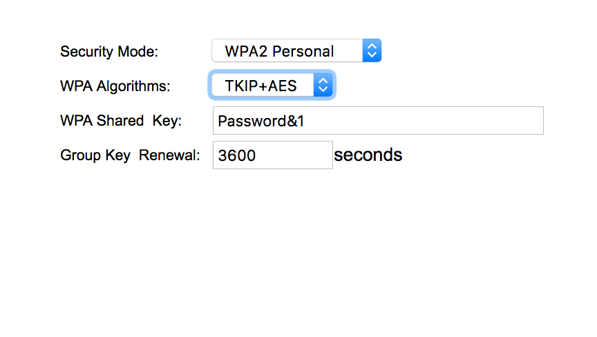
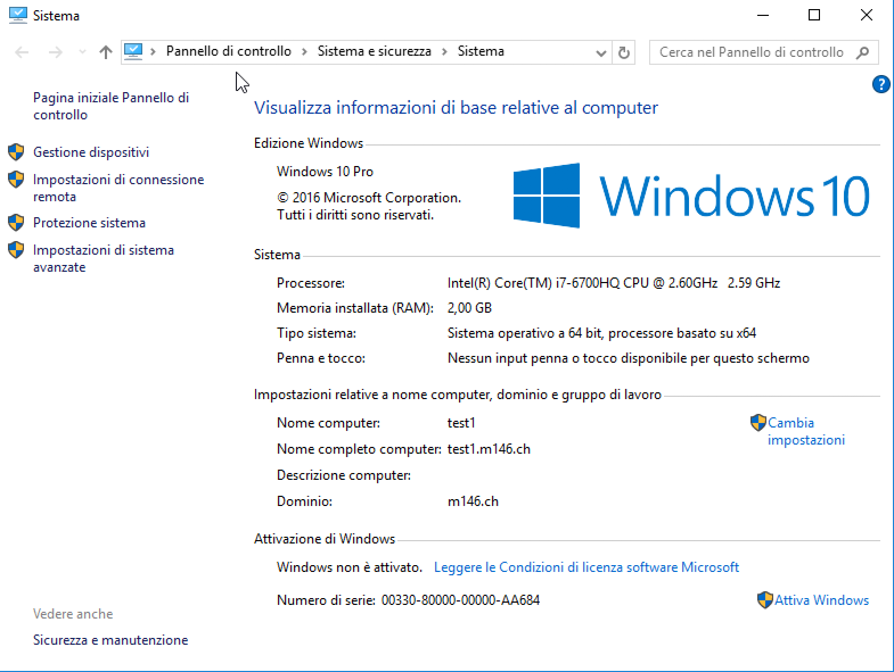

---
author:
- Samuel, Aramis
title: 
- Progetto m146
subtitle: 
- Fase intermedia
version:
- 1.0.0
date:
- \today
monofont:
- Menlo
mainfont:
- Palatino
sansfont:
- Helvetica
fontsize:
- 12pt
---

# Schema visio


# Ambiente di sviluppo

Per poter lavorare da casa ho dovuto simulare la rete interna
del firewall.

Per fare ciò ho creato una rete `NAT` in `virtualbox`.

Con il seguente comando  da terminale si può creare una rete NAT con 
la rete `10.10.10.0/24`.

``` {.bash .numberLines }
VBoxManage natnetwork add --netname m146 --network "10.10.10.0/24" --enable
```


# Firewall

Il firewall è stato configurato cambiando le seguenti informazioni


\newpage

# Access Point

L'access point è stato configurato cambiando le seguenti informazioni

Nome utente: `admin`
Password: `admin`







\newpage

# DMZ

Per configurare un DMZ ci è bastato andare a modificare una delle interfacce già presenti sul firewall, nel seguente modo


# Macchine virtuali

Tutte le operazioni sono state effettuate su delle macchine virtuali con installato la distro Linux `Alpine`, eccetto per il server contenente l'active directory, il quale è installato con Windows.

## Active Directory

Info VM:  
  - IP    10.10.10.249  
  - GATEWAY 10.10.10.1  
  - DNS   10.10.10.254

Su questo server Windows sono state aggiunte le funzionalità di Active Directory, per gestire gli utenit, e DNS, per poter reindirazzare i client sul server DNS esterno.

Per fare ciò bisogna fare un paio di passaggi.
Innanzitutto bisogna cambiare l'opzione `dynamic updates` su `Nonsecure and secure` nelle proprietà della zona `m146.ch`, per permettere la comunicazione con Linux.

  

In seguito dovremo avere il server linux accettato come indirizzo di forwarding, che si può configurare nelle proprietà del dominio

  

Infine dobbiamo aggiungere un nameserver aggiuntivo nella zona `m146.ch` contenuta nelle `Forward Lookup Zones`.

 

\newpage

## DNS e DHCP

Info VM:  
	- IP 		10.10.10.254
	- GATEWAY	10.10.10.1  
	- DNS		10.10.10.254  

Per configurare il server dns ho utilizzato `dhcpd`. 

Per installare `dhcpd` si utilizza il seguente comando.

``` { .bash .numberLines }
apk add acf-dhcp
```

Per configurarlo bisogna creare il file `dhcpd.conf` nella directory `/etc/dhcp/`.

In seguito il file di configurazione che ho fatto per il server dhcp.

``` { .bash .numberLines }
# Configurazione standard
default-lease-time 302400;
max-lease-time 604800;
ddns-update-style none;
log-facility local7;
authoritative;

subnet 10.10.10.0 netmask 255.255.255.0
{
   range "10.10.10.50 10.2.0.200";
   option domain-name-servers 10.10.10.254;
   option routers 10.10.10.249;
   option domain-name "m146.ch";
}
```

Infine i seguenti comandi per far partire il servizio dhcp e per farlo partire
a boot-time.

``` { .bash .numberLines }
rc-service dhcpd start 
rc-update add dhcpd
```

Per il server dns ho utilizzato `unbound`.

Per installarlo si utilizza il comando 

``` {.bash .numberLines }
apk add unbound
```

Per configuarlo si deve modificare il file `/etc/unbound/unbound.conf`.

```
server:
        verbosity: 1
        # Interfaccia su cui ascolta
        interface: 10.10.10.254
        do-ip4: yes
        do-ip6: yes
        do-udp: yes
        do-tcp: yes
        do-daemonize: yes
        access-control: 0.0.0.0/0 allow
	# Zona
        local-zone: "m146.ch" static
	# Address records
        local-data: "web.intranet 10800 IN A 10.10.10.251"
	local-data: "web.intranet 10800 IN A 10.10.10.251"
	local-data: "web.extranet 10800 IN A 192.168.2.13"
	local-data: "ftp.intranet 10800 IN A 10.10.10.253"
	local-data: "ftps.intranet 10800 IN A 10.10.10.252"
	local-data: "ftps.extranet 10800 IN A 192.168.2.12" 
        hide-identity: yes 
        hide-version: yes
use-syslog: yes
python:
remote-control:
        control-enable: no
forward-zone:      
        name: "."
        forward-addr: 9.9.9.9
        forward-addr: 8.8.8.8

```

Dopodichè farlo partire e fare in modo che si avvii a boot-time tramite i seguenti comandi.

``` { .bash .numberLines }
/etc/init.d/unbound start
rc-update add unbound


```

## WebServer

Info VM:  
	- IP 		10.10.10.251 
	- Alias		web.intranet 
	- GATEWAY	10.10.10.1  
	- DNS		10.10.10.254  

Il webserver installato si chiama `lighttpd`, che è molto sicuro, performante e semplice.

Per installarlo basterà eseguire il seguente comando.

``` { .bash .numberLines }
apk add lighttpd
```

Rispettivamente, per avviarlo, fermarlo o riavviarlo si possono utilizzare i seguenti comandi

``` {.bash .numberLines }
rc-service lighttpd start
rc-service lighttpd stop
rc-service lighttpd restart
```

Infine per impostarlo a runlevel, cioè che si avvii automaticamente
all'accensione del server, si utilizza il seguente comando.

``` { .bash .numberLines }
rc-update add lighttpd default
```

Se si vogliono configurare dei parametri si deve modificare il file di configurazione
al seguente percorso.

```
/etc/lighttpd/lighttpd.conf
```

Mentre il percorso di default per l'htdocs si trova al seguente percorso.

```
/var/www/localhost/htdocs/
```

## FTP

Info VM:  
	- IP 		10.10.10.253  
	- Alias		ftp.intranet
	- GATEWAY	10.10.10.1  
	- DNS		10.10.10.254  

Il servizio FTP è stato creato tramite `vsftpd` (Very Secure ftp Daemon), che è possibile installare su `Alpine` tramite il seguente comando

``` { .bash .numberLines }
apk add vsftpd
```

Il servizio sarà immediatamente utilizzabile, con gli accessi anonimi abilitati di base. Se non lo fossero, si deve modificare la seguente riga nel file `/etc/vsftpd/vsftpd.conf`.

```
anonymous_enable=YES
```

La directory a cui il servizio FTP va a riferirsi come base è configurabile nel file `/etc/passwd:`, alla riga contenente

```
ftp:x:116:116:vsftpd daemon:<path directory>:/bin/false
```

Il servizio sarà gestibile tramite i seguenti comandi

``` {.bash .numberLines }
rc-service vsftpd start
rc-service vsftpd stop
rc-service vsftpd restart
```

Come menzionato sopra, per far partire il servizio all'avvio della macchina, si utilizza il seguente comando

``` { .bash .numberLines }
rc-update add vsftpd
```

## FTPS

Info VM:  
	- IP 		10.10.10.252
	- Alias		ftps.intranet	
	- GATEWAY	10.10.10.1  
	- DNS		10.10.10.254  

Il procedimento per l'installazione di questo servizio è lo stesso di quello FTP. L'unica differenza è l'utilizzo dei certificati SSL/TLS per maggiore sicurezza.

La prima cosa da fare, dopo aver installato il servizio, è creare il certificato che andremo ad utilizzare, tramite il comando, che creerà sia il certificato che la chiave in un unico file

``` { .bash .numberLines }
openssl req -x509 -nodes -days 365 -newkey rsa:1024 -keyout /etc/ssl/private/vsftpd.pem -out /etc/ssl/private/vsftpd.pem
```  

Dopo averlo creato, dovremo andare a notificare vsftpd che deve utilizzare il certificato, cosa che possiamo fare modificando il file `/etc/vsftpd/vsftpd.conf`, al quale aggiungeremo/decommenteremo le seguenti righe

```
ssl_enable=YES    	# Abilito SSL

implicit_ssl=YES	# Abilito la connessione implicita SSL sulla porta 990
listen_port=990	  	

anonymous_enable=YES

allow_anon_ssl=YES 
force_local_data_ssl=YES  	# Encripto i dati e i login
force_local_logins_ssl=YES  #

rsa_cert_file=/etc/ssl/private/vsftpd.pem   		# Certificato
rsa_private_key_file=/etc/ssl/private/vsftpd.pem 	# Chiave

ssl_tlsv1=YES 	# Abilitiamo l'uso di TLS
ssl_sslv2=NO 	# Disabilitiamo le alternative
ssl_sslv3=NO 	#
```

Infine dobbiamo riavviare il servizio tramite il comando citato nella sezione precedente.

# Firewall

# Test

+----------------------+---------------------------------------------------------------------------+
|    **Test Case**     |                                  TC-001                                   |
+======================+===========================================================================+
| **Nome**             | Webserver                                                                 |
+----------------------+---------------------------------------------------------------------------+
| **Descrizione**      | Testa il corretto funzionamento del webserver, se risponde alle richieste |
+----------------------+---------------------------------------------------------------------------+
| **Prerequisiti**     |                                                                           |
+----------------------+---------------------------------------------------------------------------+
| **Procedura**        | In una `bash`, utilizzare il comando `wget 10.10.10.251`                  |
+----------------------+---------------------------------------------------------------------------+
| **Risultati attesi** | Il file index.html viene salvato nella directory attuale                  |
+----------------------+---------------------------------------------------------------------------+

+----------------------+---------------------------------------------------------------------+
|    **Test Case**     |                               TC-002                                |
+======================+=====================================================================+
| **Nome**             | DHCP                                                                |
+----------------------+---------------------------------------------------------------------+
| **Descrizione**      | Testa il corretto funzionamento server dhcp                         |
+----------------------+---------------------------------------------------------------------+
| **Prerequisiti**     |                                                                     |
+----------------------+---------------------------------------------------------------------+
| **Procedura**        | Collegare una macchina virtuale alla rete virtuale NAT.  In seguito |
|                      | utilizzare il comando `ifconfig` e                                  |
+----------------------+---------------------------------------------------------------------+
| **Risultati attesi** | controllare che la interfaccia abbia un indirizzo IP compreso tra   |
|                      | `10.10.10.50` e `10.10.10.200`                                      |
+----------------------+---------------------------------------------------------------------+

\newpage

+----------------------+---------------------------------------------------------------------+
|    **Test Case**     |                               TC-003                                |
+======================+=====================================================================+
| **Nome**             | FTP                                                                 |
+----------------------+---------------------------------------------------------------------+
| **Descrizione**      | Testa il corretto funzionamento server FTP                          |
+----------------------+---------------------------------------------------------------------+
| **Prerequisiti**     |                                                                     |
+----------------------+---------------------------------------------------------------------+
| **Procedura**        | Accedere tramite un client ftp al server                            |
+----------------------+---------------------------------------------------------------------+
| **Risultati attesi** | Accesso al server FTP ottenuto, e possibilità di scaricare e        |
|                      | caricare file da esso                                               |
+----------------------+---------------------------------------------------------------------+

+----------------------+---------------------------------------------------------------------+
|    **Test Case**     |                               TC-003                                |
+======================+=====================================================================+
| **Nome**             | FTPS                                                                |
+----------------------+---------------------------------------------------------------------+
| **Descrizione**      | Testa il corretto funzionamento server FTPS                         |
+----------------------+---------------------------------------------------------------------+
| **Prerequisiti**     |                                                                     |
+----------------------+---------------------------------------------------------------------+
| **Procedura**        | Accedere tramite un client ftp al server                            |
+----------------------+---------------------------------------------------------------------+
| **Risultati attesi** | Accesso al server FTP ottenuto, con la dovuta richiesta di conferma |
|                      | del certificato, e possibilità di scaricare e caricare file da esso.|
+----------------------+---------------------------------------------------------------------+

+----------------------+-------------------------------------------------------------------------------+
|    **Test Case**     |                                    TC-004                                     |
+======================+===============================================================================+
| **Nome**             | Active Directory                                                              |
+----------------------+-------------------------------------------------------------------------------+
| **Descrizione**      | Testa l'utente in active directory                                            |
+----------------------+-------------------------------------------------------------------------------+
| **Prerequisiti**     |                                                                               |
+----------------------+-------------------------------------------------------------------------------+
| **Procedura**        | Accedere tramite l'utente di dominio `giorgio.lucchini` password `Password&1` |
+----------------------+-------------------------------------------------------------------------------+
| **Risultati attesi** | Il client riesce ad accedere al dominio.                                      |
+----------------------+-------------------------------------------------------------------------------+


\newpage

## Active Directory

<<<<<<< HEAD
=======
  
>>>>>>> 9b9d759867f1fc3163c38ded1467e053268c09b5

## FTP

Dopo aver installato il server FTP, ci basterà cercre di collegarci con un client FTP (nel mio caso winSCP), e verificare che il collegamento vada a buon fine

  

\newpage

## FTPS

Come per il servizio FTP, bisognerà collegarsi al server tramite client, utilizzando però SSL/TLS

  

Se il collegamento va a buon fine dovrebbe mostrere i certificati SSL/TLS trovati nel server, e chiedere di accettarli. 

  

\newpage

## WEB

<<<<<<< HEAD
| [Webserver](images/web_dns.png)
=======
<<<<<<< Updated upstream
Comando

```
wget web-intranet
```

Risultato

```
Connecting to web-intranet (10.10.10.251:80)
index.html           100% |***|    36   0:00:00 ETA
```
>>>>>>> 9b9d759867f1fc3163c38ded1467e053268c09b5

## DNS

Comando

```
dig @10.10.10.254 web-intranet
```

Risultato 

```
; <<>> DiG 9.9.7-P3 <<>> @10.10.10.254 web-intranet
; (1 server found)
;; global options: +cmd
;; Got answer:
;; ->>HEADER<<- opcode: QUERY, status: NOERROR, id: 5865
;; flags: qr aa rd ra; QUERY: 1, ANSWER: 1, AUTHORITY: 0, ADDITIONAL: 1

;; OPT PSEUDOSECTION:
; EDNS: version: 0, flags:; udp: 4096
;; QUESTION SECTION:
;web-intranet.                  IN      A

;; ANSWER SECTION:
web-intranet.           10800   IN      A       10.10.10.251

;; Query time: 63 msec
;; SERVER: 10.10.10.254#53(10.10.10.254)
;; WHEN: Fri Mar 09 16:03:44 CET 2018
;; MSG SIZE  rcvd: 57
```

## DHCP
 
 Risultato

 ```
en7: flags=8963<UP,BROADCAST,SMART,RUNNING,PROMISC,SIMPLEX,MULTICAST> mtu 1500
        options=4<VLAN_MTU>
        ether 00:24:9b:23:e9:4a 
        inet6 fe80::146a:b5c6:f53c:d5e%en7 prefixlen 64 secured scopeid 0x10 
        inet 10.10.10.102 netmask 0xffffff00 broadcast 10.10.10.255
        nd6 options=201<PERFORMNUD,DAD>
        media: autoselect (100baseTX <full-duplex>)
        status: active
 ```

